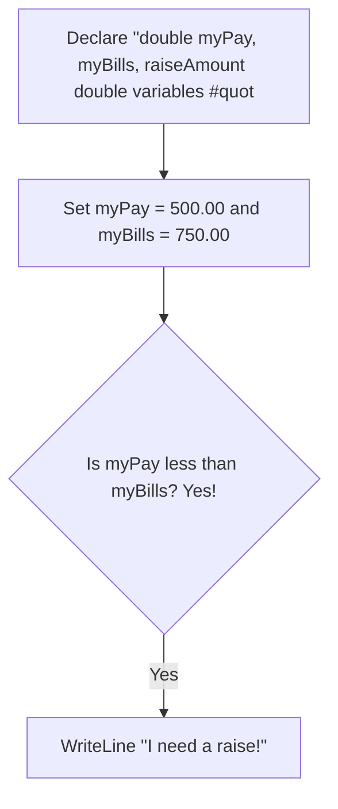
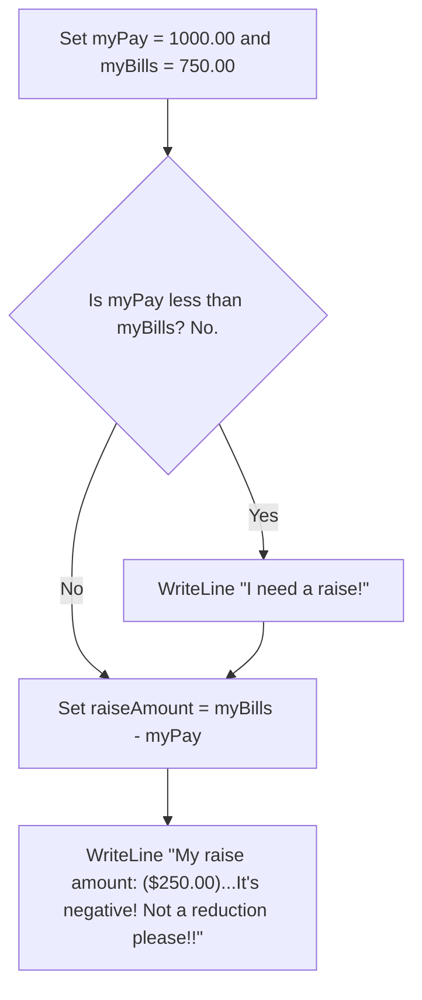
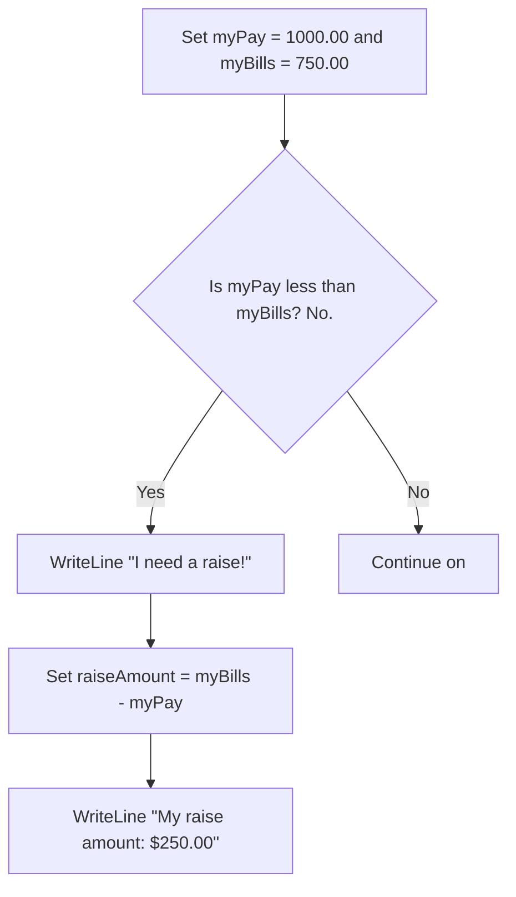

# Using Braces in Conitionals

I got the following question from a student: "For an if statement, when do we and don’t put the brackets around the statement?"  
  
In short, you need braces when you have more than one statement to process in your if condition. Let's look at some examples.  

## If Condition with One Statement 

```csharp
  double myPay, myBills, raiseAmount;
  myPay = 500.00;
  myBills = 750.00;
  if (myPay < myBills)
      WriteLine("I need a raise!");
```

Here is a flowchart representing the above code:  

<!-- below from https://github.com/mermaid-js/mermaid -->

Console output:

```txt
I need a raise!
```

However, in my view, I think braces should be used at all times as this is more readable:

```csharp
double myPay, myBills;
myPay = 500.00;
myBills = 750.00;
if (myPay < myBills)
{
    WriteLine("I need a raise!");
}
```

----
## If Condition with More Than One Statement `NOT` Using Braces

```csharp
  //If you have multiple statements, then braces are needed as the initial semicolon terminates the statement:
  myPay = 1000.00;
  myBills = 750.00;
  if (myPay < myBills)
    WriteLine("I need a raise!");
  //the next 2 statements below should not be executed as the pay is more than the bills, however
  //the semicolon at the end of the WriteLine above terminates the if statement and the WriteLine
  //below will always be displayed, even when logically it should not.
  raiseAmount = myBills - myPay;
  WriteLine("My raise amount: {0}...It's negative! Not a reduction please!!", raiseAmount.ToString("C"));
```



Console output:

```txt
My raise amount: ($250.00)...It's negative! Not a reduction please!!
```

----

## If Condition with More Than One Statement Using Braces

```csharp
  //As you can see below, the brakets group multiple statements in a logical unit, in 
  //spite of the semicolons terminiating each statement.
  myPay = 500.00;
  myBills = 750.00;
  if (myPay < myBills)
  {
      WriteLine("I need a raise!");
      raiseAmount = myBills - myPay;
      WriteLine("My raise amount: {0}", raiseAmount.ToString("C"));
  }
```


Console output:

```txt
I need a raise!
My raise amount: $250.00
```

----

## Another If Condition with More Than One Statement Using Braces

```chsharp
  //Now, none of the statements will be executed in the if condition
  myPay = 1000.00;
  myBills = 750.00;
  if (myPay < myBills)
  {
      WriteLine("I need a raise!");
      raiseAmount = myBills - myPay;
      WriteLine("My raise amount: {0}", raiseAmount.ToString("C"));
  }
```



For the above, there is no console output as no WriteLine functions were called.  

For more see [C# if-else statement: Curly braces or not?](https://social.technet.microsoft.com/wiki/contents/articles/37763.c-if-else-statement-curly-braces-or-not-an-in-depth-analysis.aspx).
